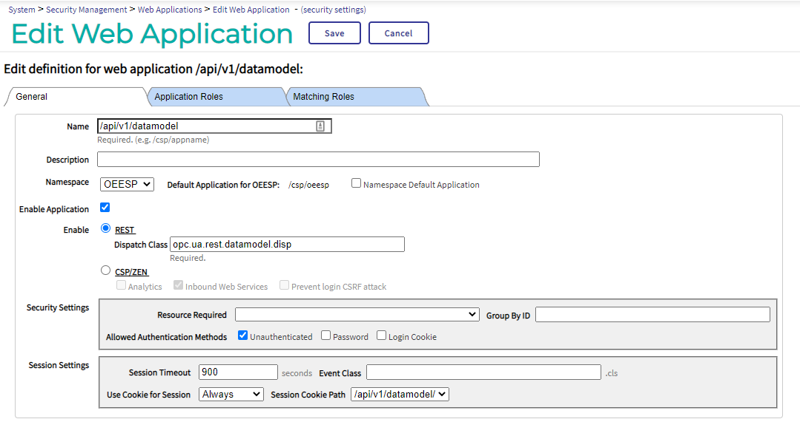
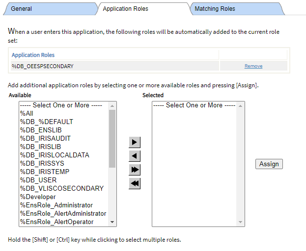
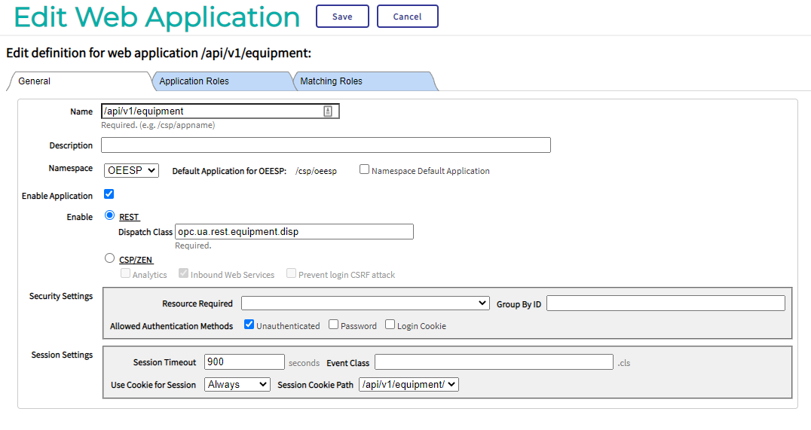
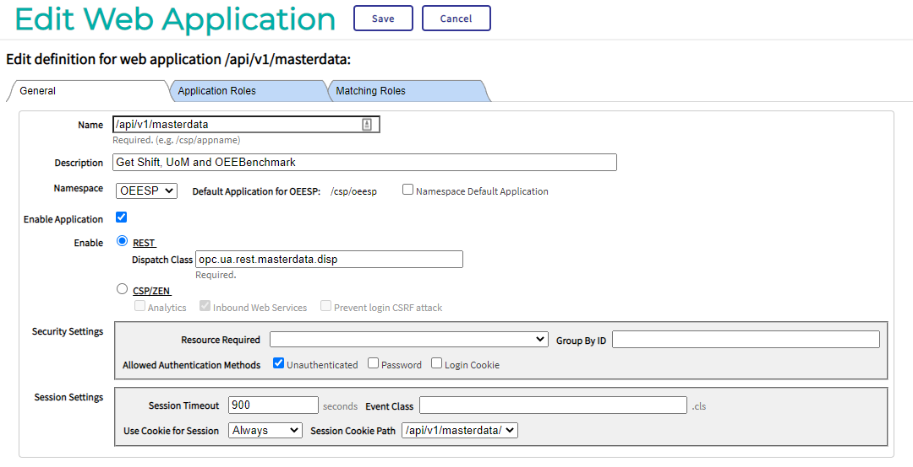

# ASP - OEE Dashboard
Application Starter Pack for manufacturing companies using OPC-UA for OEE Dashboard. The Starter Pack is a generic framework for fast generation and consists of :
1.  API for managing master data
2. 	API for equipment setup with there related data from the PLC
3. 	API for datastructure generation
4. 	API for sending information to PowerBI using the Push DataSet interface
5. 	Integration example with JD Edwards

The Starter Pack is used within a project in a manufacturing plant to give operators realtime insight in OEE and other custom metrics witihin there process. For more information about the functional and technical working see the Wiki https://github.com/intersystems/asp-oee/wiki of the project.

# Structure
The repository has been separated in 4 parts.

## Classes
The source of this solution divided in:
* JDE integration sources
* OPC-UA generation framework
* PowerBI push dataset integration

## Images
The images used within the Wiki

## Postman
PostMan projects to get started quickly with this project

## Python
This solution uses the Intersystems Python Gateway https://openexchange.intersystems.com/package/PythonGateway with the free OPC-UA library  https://github.com/FreeOpcUa/opcua-asyncio

# Getting started

## Installation

1. Create a namespace with the name OEESP
1. Install the InterSystems Python Gateway https://openexchange.intersystems.com/package/PythonGateway
2. Install the InterSystems classes. This can be easily done by using this tool https://github.com/gertjanklein/iris-export-builder
3. Install the python code in a directory on your machine and get the requirements by running 
   ```pip install -r requirements.txt```
4. Install Postman (https://www.postman.com/downloads/)

## Initial configuration

Before we can really use the solution we need to create manually the webapplications. 
Go in the Management Portal to System Administration -> Security -> Applications -> Web Applications

### DataModel 

* Name -  /api/v1/datamodel
* Dispatch Class - opc.ua.rest.datamodel.disp
* Security Settings - Unauthenticated 





### Equipment 

* Name - /api/v1/equipment
* Dispatch Class - opc.ua.rest.equipment.disp
* Security Settings - Unauthenticated




### Master data

* Name - /api/v1/masterdata
* Dispatch Class - opc.ua.rest.masterdata.disp
* Security Settings - Unauthenticated




## Postman StarterProject

There are 2 postman projects available that you can import in postman to get you started.

 * StarterPack collection consists of all available URL's within the Rest Services
 * StarterPack example collection is a simple example to get you up and running with a simple 3 layer (staging, transformation and serving) setup for 1 equipment and some nodes.
 * The StarterPack Development enviroment for running the projects locally  


